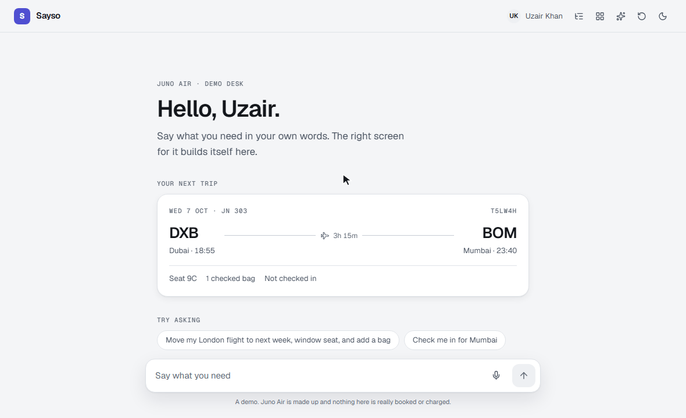
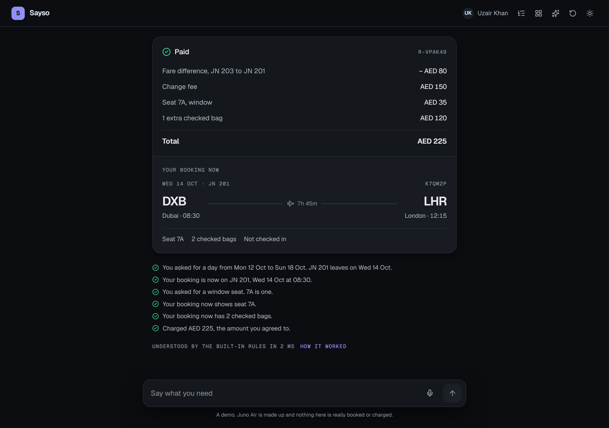
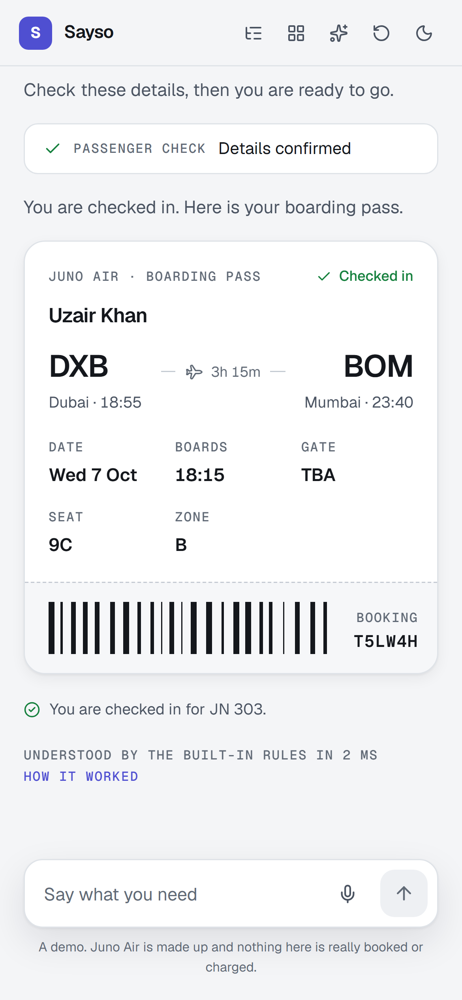
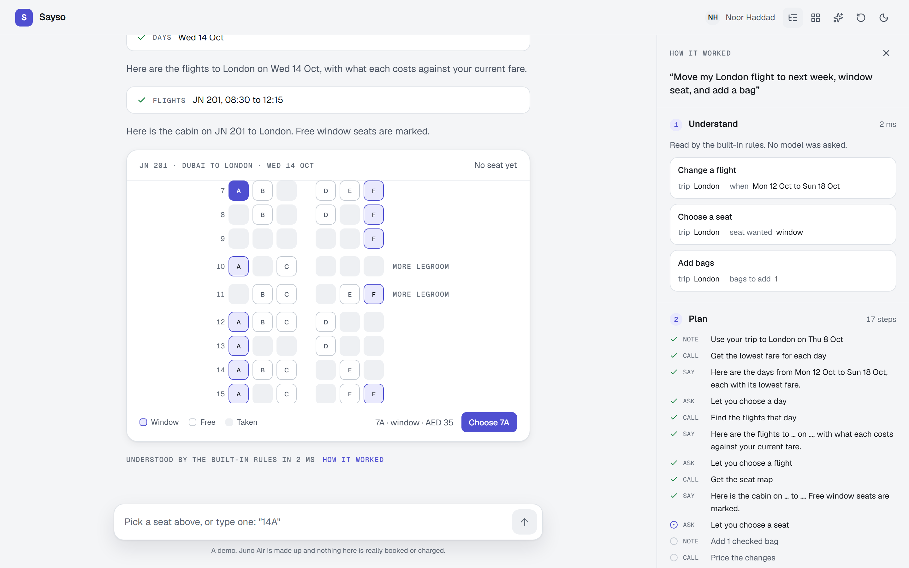
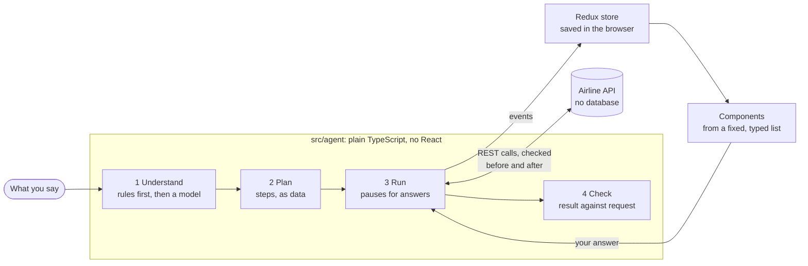
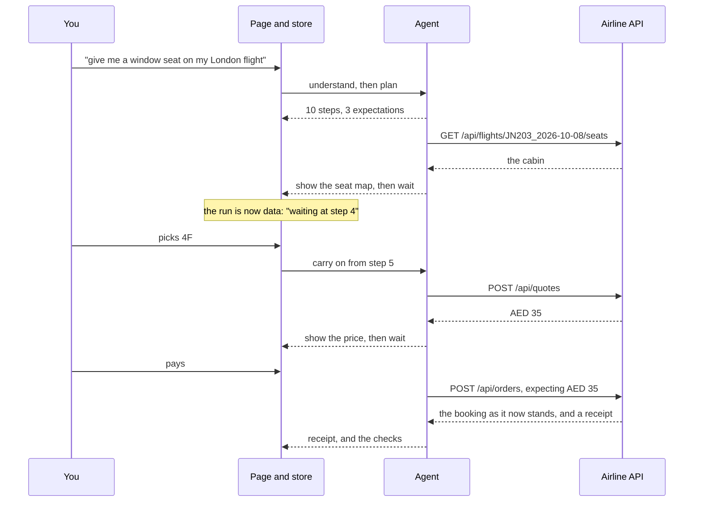

# Sayso

Say what you need, and the screen builds itself.

Sayso is a service desk for a made-up airline. You type what you want in your own words, and instead of a wall of text the reply is built from working pieces of interface: days to pick from, a flight list, a seat map, a price, a receipt.

**Live: https://sayso-sigma.vercel.app**



## Try it in a minute

Open the live site. No account and no key are needed.

1. Click **"Move my London flight to next week, window seat, and add a bag"**. That is three requests in one sentence.
2. Pick a day, a flight and a seat. Each component folds into one line as you answer it.
3. One price covers all three. Pay it (nothing is really charged) and read the checks under the receipt.
4. Click **How it worked** to see what was understood, the plan, every call to the airline's API with the data that came back, and the checks.

Then try typing instead of clicking: "the cheapest", "14A", "yes". Or change your mind partway: "aisle instead".

## What you can ask for

Eight journeys, in your own words, several in one sentence if you like:

| Journey | Try saying |
| --- | --- |
| See my trips | "Show my trips" |
| Flight status | "Is my flight on time?" |
| Change a flight | "Move my London flight to next week" |
| Choose a seat | "Give me a window seat" |
| Add bags | "Add two bags to my Istanbul flight" |
| Check in | "Check me in" |
| Cancel and refund | "Cancel my Istanbul trip" |
| Book a flight | "Book a flight to Paris next Friday" |

Beyond the journeys, the desk answers questions about your own account: "How much have I spent this year?", "Show my spending by route", "Show my recent payments". There is no screen designed for each question. Whoever understands it picks from ready-made views of the account, and the code works out every number.

Where the browser can listen (Chrome, Edge and Safari), a microphone appears in the ask bar: say it instead of typing it.

Replies are built from fourteen components, all on the [gallery page](https://sayso-sigma.vercel.app/gallery): trips, which-trip question, flight search, days, flights, seat map, bag stepper, passenger check, refund, price summary, receipt, boarding pass, status timeline and answer card.

| The end of a request, dark theme | On a phone |
| --- | --- |
|  |  |

## How it works



Every request goes through four steps. All four are plain TypeScript in `src/agent`, with no React and no Redux in them, so they are tested without a browser.

1. **Understand.** The words become intents: which journey, which trip, what details. Rules do this first, with no model and no key. What they cannot read goes to a model, if you have given one.
2. **Plan.** The intents become a list of steps: say a line, call the airline's API, show a component. A plan is plain data. Where a step needs something only known later, it holds a reference to the step that will produce it: `{{seat.seat}}`, `{{quote.total}}`.
3. **Run.** The steps run one by one, each reported as an event. When a component needs an answer, the run stops and waits. It picks up again when the answer is in.
4. **Check.** The plan carries its own expectations, written before anything ran. Each is compared with the result and shown: "You asked for a window seat. 4A is one."



A run, for "give me a window seat on my London flight":



### The decisions behind it

- **The plan chooses, the code computes.** A plan can only ask for components from a fixed list (`src/widgets/specs.ts`), with the properties each one's schema allows. Every price, seat and flight on screen comes from the airline's API by reference. References are path lookups, never code that is run.
- **One schema, four uses.** Each component's Zod schema checks a plan before anything is drawn, describes the component to a model, documents it on the gallery page and at `/api/catalog`, and types the React component. `src/widgets/registry.tsx` stops compiling if a schema has no component.
- **A run is data, not a process.** "Waiting at step 4 for a seat" is a value in the Redux store and in the browser's storage. Reload the page halfway through and the seat map is still there, waiting.
- **A change of mind re-plans; it does not restart.** "Aisle instead" plans the request afresh and lays the new plan over the old run. Everything before the first step that differs is kept, with its results, so nothing is fetched twice.
- **Several journeys, one order.** Journeys that cost money each add a change to one shared order, so a sentence with three requests ends in one price, one confirmation and one receipt.
- **The server never trusts a price from the browser.** Confirming an order makes the server work the price out again and refuse if it differs.
- **Rules first, model second.** A sentence the rules can read never reaches a model. The whole demo works with no key.
- **A model may choose a layout, never a number.** For a question about your account, the model's whole answer is a list of view names, such as `["spending", "spending-by-month"]`. The sums, the months and the chart are worked out in `src/agent/views.ts`.

### State

Redux Toolkit holds the conversation, the account, the model settings and what is open on the page. The agent reports events; one reducer function (`reduceRun`) turns them into state, and the store, the agent and the tests all use that same function. React Context carries the theme and toasts.

## The model is optional

The desk works with no model: rules understand the eight journeys and answer the commonest questions about cost from the airline's own facts.

Add a key in the sparkle menu (Gemini and Groq both have free tiers) and the desk also reads freer sentences ("I'd love to look out at the clouds on the way to London") and answers other questions in words. The key stays in your browser and calls go straight from the browser to the provider. Sayso's server never sees it.

- **The model's reply is data, and is checked.** It must be JSON that fits a schema, names only bookings you have and places the airline flies. A reply that does not fit is sent back once with what was wrong, then dropped.
- **The model never writes what you see in a component.** It says which journey the words ask for. The steps of each journey are written by hand, so a sentence can be misread but can never produce a screen nobody designed.
- **Each reply says who understood it**, and an answer written by a model is marked as such.

## The airline's REST API

The airline keeps no database. Flights, prices and free seats are worked out from the route and the date, so every visitor sees the same timetable. Bookings live in the visitor's browser and travel with each request.

| Method | Route | Returns |
| --- | --- | --- |
| GET | `/api/flights?from=DXB&to=LHR&date=2026-10-15` | Every flight on that route that day |
| GET | `/api/flights/calendar?from=DXB&to=LHR&start=2026-10-12&days=14` | The cheapest fare on each day |
| GET | `/api/flights/:id/seats` | The cabin of one flight, with taken seats marked |
| GET | `/api/flights/:id/status?at=2026-10-06T10:30:00Z` | Where one flight stands at a moment: late or not, gate, steps to landing |
| POST | `/api/quotes` | What a list of changes to a booking would cost |
| POST | `/api/orders` | The booking after the changes, and a receipt |
| GET | `/api/catalog` | Every journey, component and call, with its JSON Schema |
| GET | `/api/health` | `{ status: "ok" }` |

Errors are `{ error: { code, message } }` with a message fit to show to a person. The agent may only call these through `src/agent/tools.ts`, which checks the arguments before each call and the answer after it.

## Run it yourself

```bash
npm install
npm run dev        # http://localhost:3030
```

Needs Node 24. Nothing else: no database, no environment variables, no key.

With Docker:

```bash
docker compose up --build      # http://localhost:3000
```

On Kubernetes, two copies behind one Service. The app keeps nothing on the server, so any number of copies can run side by side:

```bash
docker build -t sayso:local .
kubectl apply -f deploy/k8s.yaml
kubectl port-forward service/sayso 3000:80
```

Docker and kubectl are not installed on the machine this was written on. Both are proven in CI instead: every push builds the image, starts it, calls its routes, then applies the manifest to a real one-node cluster and waits for both copies to pass their health checks.

## Tests

```bash
npm run lint
npm run typecheck
npm test                              # unit tests, Vitest
npm run build && CI=1 npm run e2e     # end-to-end tests, Playwright, against the production build
```

- **Unit tests** cover the airline (timetable, cabin, pricing, status), the four steps of the agent, the model path with a stand-in provider, and the store. They never touch the network: requests are handed straight to the real route handlers inside the test process, so a test of the agent also exercises the routes.
- **End-to-end tests** drive the real app in a browser with the clock fixed: every journey by clicking and by typing, a reload halfway through, a failed call, the model path against a stand-in provider, the keyboard alone on the seat map, and a phone-sized screen.
- **Accessibility scans** (axe, WCAG 2.1 A and AA) run in both themes over every component and every state of the desk.

All of it runs in CI on every push.

`npm run screenshots` and `npm run gif` retake this README's pictures from the running app, with the clock fixed so they come out the same each time.

## Layout

```
src/app/            the desk, the gallery, and the REST routes under api/
src/airline/        timetable, cabin, pricing, status, the demo account (no database)
src/agent/          understand, plan, run, check: plain TypeScript, no React
src/widgets/        the components a reply is built from, and their schemas
src/ai/             the visitor's model settings, and one caller for every provider
src/store/          Redux Toolkit: conversation, account, settings, saving to the browser
src/components/     the desk page, the ask bar, a turn, the "How it worked" panel
tests/e2e/          Playwright
deploy/             the Kubernetes manifest
scripts/            the README's screenshots and demo GIF
```

## Limits

- Juno Air is made up. Nothing is really booked, charged or refunded.
- The rules read English, and the common ways of asking. Unusual sentences need a model.
- The account lives in one browser. The demo trips are dated from the day of the visit, so they are made afresh each day.
- Each airport keeps one time offset all year. Daylight saving is ignored.
- Voice input is the browser's own speech recognition. It is tested with a stand-in, because a test cannot talk; Firefox has none, so it shows no microphone.
- The model path is tested against a stand-in provider. A live model can still misread a sentence; when it does, the desk says it did not understand.

## Licence

MIT.
